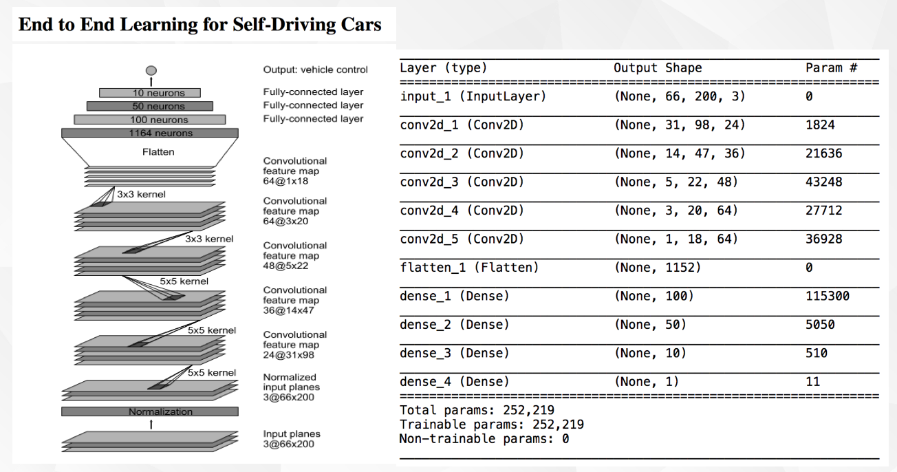
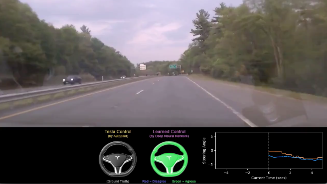

# MIT6.S094-DeepTesla

**DeepTesla** is one of the assignments in  [MIT 6.S094: Deep Learning for Self-Driving Cars](https://selfdrivingcars.mit.edu/)[Skip to content](https://selfdrivingcars.mit.edu/deepteslajs/#content). The main goal of this project is to predict the steering angle from the current driving images.

## Dataset

Data could download from [here](https://github.com/lexfridman/deeptesla/tree/master/epochs ), contains 10 videos and 10 .csv files (sync steering angles). The first 9 videos and csv files are supposed to used for training, and the last video and csv file are for testing.   

Clip driving video frame by frame, get 24300 720x1280x3  RGB images for training, 2700 images for testing.   

Left: driving image;   Right: sync steering angles.

**Data Exploration**

The distribution of steering angles is unblanced, sharp-turning are very few.

### Data Preprocess

* Image Crop： 720\*1280\*3 -> 330\*1280\*3，remove sky and window reflection area；   

* Image Resize：330\*1280\*3 -> 66\*200\*3;  

* RGB to YUV ;   

* Normalization: scale pixel value [0-255] to [0-1];  

* Data Augmentation:    

  during `Error Analysis`, find the lacking of truning images leads to overfit problem. Images number increases from 24300 to 51022，images with absolute angle≥3 increase 13448.

  * Flip horizontal: Random sample 2300 if this angle has more than 2300 training images;    
  * Add random shadow: sample 10%, add vertical shadow; sample 10%, add horizontal shadow. Cover the original image if this angle has more than 2300 training images.   

## Training

### Basic Model

Use this model as basic model architecture, put forwarded by NVIDIA in 2016. 

* Input：66\*200\*3 YUV images  
* Normalization layer, scale pixel vale to [0-1]  
* 5 conv layers:  
  * The first three conv layer, stride=2, kernel_size=5x5，padding=valid；
  * The last two conv layer, stride=1, kernel_size=3x3，padding=valid；
* 3 fully connected layer with 100, 50, 10 units respectively。
* Output：steering angle

### Model Optimization

#### Change model arcitecture

tried several method, add **Batch Normalization** and **dropout** will imporve model.

* Add Batch Normalization;  
* Use maxpooling, change stride to 1 in the first three conv layers;
* Add dropout after `3th conv layer`, `5th conv layer`, `1th fc layer`, with drop rate 0.2;   
* Use 3x3 conv kernal in the first three conv layer, add conv layer after every two conv layers.

#### Data Augmentation

After trained model with Batch Normalization and dropout, there still remain 1.7+ error between test MSE and val MSE. So do **Error Analysis**, find the lacking of truning images leads to overfit problem. **Data Augmentation** helped, Images increases from 24300 to 51022，images with absolute angle≥3 increase 13448.  

#### Fine Tuning

use `grid search` and `random search` search learn appropriate rate and drop rate.

Set grid search parameter: dropout rate：(0.1, 0.2, 0.3);  learning rate：(0.001, 0.01, 0.05).   (0.3, 0.001) and (0.3, 0.01) get best result, test MSE are 2.05 and 2.08 respectively.

Random choose six learning rates in (0.001, 0.01), choose three drop rates in (0.25, 0.35), get 18 parameter sets. After trained these 18 sets, (0.329172504，0.001904038) get the best result, **test MSE is 1.79, mean absolute error is 1.04**.

#### Transfer Learning

Alse tried tranfer learning using VGG-16, but could not get better result.

## Result

Blue line: True steering angle;     

Orange line: Predict steering angle.  

### Result Visualization 

 `epoch10_human_machine.mp4`  combines predict  and true steering angle in pne frame image.

